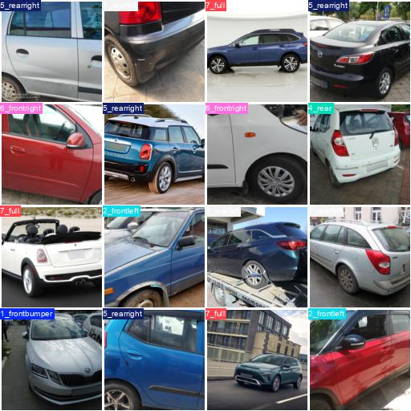

# 🚗 Vehicle Orientation Classification

## 🌟 Sample Outputs
Below are some sample output images showcasing the classified vehicle orientations:

 [Output 2](sample_outputs/val_batch1_labels.jpg)
 [Output 4](sample_outputs/val_batch3_labels.jpg)


## 📌 Overview
This project implements a **YOLO-based classification model** to determine vehicle orientation. It includes:
- Data preprocessing and annotation handling
- Model training with optimized hyperparameters
- Predicting class labels for test images using a **TFLite model**
- Performance evaluation with precision, recall, and F1-score

---

## 📂 Dataset Preparation

### 🛠️ Script: `classification_from_annotation.py`
**Objective:** Classify images into **six categories** based on vehicle orientation using VIA JSON annotations.

### 🔹 Input Dataset Structure:
```
📎 exercise_1/
 ├── 📁 subfolder_1/
 │    ├── image_1.jpg
 │    ├── image_2.jpg
 │    └── via_region_data.json
 ├── 📁 subfolder_2/
 │    ├── image_3.jpg
 │    └── via_region_data.json
```

### 🔹 Categories:
| Class | Included Labels | Excluded Labels |
|--------|----------------|----------------|
| **1. Front Bumper** | `frontbumper`, `logo`, `grille` | `doors`, `wheelrim` |
| **2. Front Left** | `leftfrontdoor`, `leftfrontdoorglass` | `leftreardoor`, `lefttailgate` |
| **3. Rear Left** | `leftreardoor`, `leftreardoorglass` | `leftfrontdoor`, `leftfrontventglass` |
| **4. Rear** | `rearbumper`, `logo`, `rearws` | `doors`, `tyre` |
| **5. Rear Right** | `rightreardoor`, `rightreardoorglass` | `rightfrontdoor`, `rightfrontventglass` |
| **6. Front Right** | `rightfrontdoor`, `rightfrontdoorglass` | `rightreardoor`, `righttailgate` |

- **Fallback Folder:** Images that don't fit any category are moved to `none/`.

---

## 📊 Training the Model

### 🛠️ Script: `train.py`
This script trains a **YOLO classification model**.

### 🔹 Model:
- **Pretrained model:** `yolo11x-cls.pt`
- **Dataset location:** `./split_dataset`

### 🔹 Hyperparameters:
| Parameter | Value |
|-----------|------|
| **Epochs** | 40 |
| **Batch Size** | 9 |
| **Image Size** | 128x128 |
| **Learning Rate** | 0.0001 |
| **Optimizer** | Adam |
| **Device** | GPU (`device=0`) |
| **Workers** | 8 |

### 🔹 Data Augmentations:
| Augmentation | Value |
|-------------|------|
| Random Erasing | 0.02 |
| Flip (vertical) | Disabled |
| Flip (horizontal) | Disabled |

### 🏆 **Output Directory:** `runs/classify/yolo11_classifier7`

---

## 🔍 Prediction Workflow

### 🛠️ Script: `test_predict.py`
Uses a **TFLite model** for inference.

### 🔹 Model Details:
| Parameter | Value |
|-----------|------|
| **Model File** | `vehicle_ori_classifier_128_float32.tflite` |
| **Input Size** | `128x128` |
| **Normalization** | Pixel values in `[0,1]` |

### 🔹 Classes:
- **1_front**
- **2_frontleft**
- **3_rearleft**
- **4_rear**
- **5_rearright**
- **6_frontright**
- **7_full** (complete car side image)
- **8_part** (close-up view of a vehicle part)

### 🔹 Prediction Process:
1. **Preprocess test images**
2. **Run inference on TFLite model**
3. **Generate class label + confidence score**
4. **Save results to `predictions.csv`**
5. **Generate classification report (`classification_report.txt`)**

---

## 📊 Performance Metrics

| Class | Precision | Recall | F1-score | Support |
|--------|-----------|-------|---------|---------|
| **1_front** | 0.81 | 0.91 | 0.86 | 65 |
| **2_frontleft** | 0.92 | 0.88 | 0.90 | 68 |
| **3_rearleft** | 0.93 | 0.89 | 0.91 | 64 |
| **4_rear** | 0.83 | 0.95 | 0.88 | 40 |
| **5_rearright** | 0.96 | 0.93 | 0.94 | 70 |
| **6_frontright** | 0.92 | 0.86 | 0.89 | 64 |
| **7_full** | 0.88 | 0.84 | 0.86 | 99 |
| **8_part** | 0.67 | 0.71 | 0.69 | 51 |

**Overall Accuracy:** **87%**

---

## 🚀 How to Run

### 🔹 Run Training:
```bash
python train.py
```

### 🔹 Run Prediction:
```bash
python test_predict.py
```

### 🔹 Expected Output:
- `predictions.csv` (classification results)
- `classification_report.txt` (performance metrics)

---

## 📌 Key Features
👉 **YOLO-based orientation classification**  
👉 **Annotation-based dataset filtering**  
👉 **Optimized training with augmentations**  
👉 **TFLite model for fast inference**  
👉 **High accuracy (87%) with detailed evaluation**  

---

